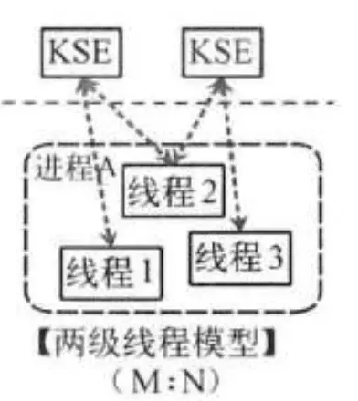

操作系统层面下：并发都是以线程的形态存在

体系框架可以分为用户空间和内核空间，内核空间主要操作访问CPU资源，I/O资源，内存资源等硬件资源，为上层应用程序提供最基本的基础资源，用户空间是上层应用程序的固定活动空间，用户空间不可以直接访问资源，必须通过“系统调用”、“库函数”或“Shell脚本”来调用内核空间提供的资源。

我们现在的计算机语言，可以狭义的认为是一种“软件”，所谓的“线程”，往往都是用户态的线程，和操作系统本身内核态的线程（简称KSE），还是有区别的

线程模型的实现可以分为几种：

###### 用户级线程模型

如图所示，多个用户态的线程对应着一个内核线程，程序线程的创建、终止、切换或者同步等线程工作必须自身来完成。它可以做快速的上下文切换。缺点是不能有效利用多核CPU。

###### 内核级线程模型

这种模型直接调用操作系统的内核线程，所有线程的创建、终止、切换、同步等操作，都由内核来完成。一个用户态的线程对应一个系统线程，它可以利用多核机制，但上下文切换需要消耗额外的资源。C++就是这种。

###### 两级线程模型

这种模型是介于用户级线程模型和内核级线程模型之间的一种线程模型。这种模型的实现非常复杂，和内核级线程模型类似，一个进程中可以对应多个内核级线程，但是进程中的线程不和内核线程一一对应；这种线程模型会先创建多个内核级线程，然后用自身的用户级线程去对应创建的多个内核级线程，自身的用户级线程需要本身程序去调度，内核级的线程交给操作系统内核去调度。

M个用户线程对应N个系统线程，缺点增加了调度器的实现难度。

Go语言的线程模型就是一种特殊的两级线程模型（GPM调度模型）。

